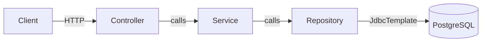

# Spring Boot JDBC CRUD — Student Management

## Project Structure

```
test/
├── pom.xml
├── mvnw.cmd
├── .mvn/wrapper/maven-wrapper.properties
└── src/main/
    ├── java/com/example/studentcrud/
    │   ├── StudentCrudApplication.java          # Entry point
    │   ├── model/Student.java                   # Entity POJO
    │   ├── repository/StudentRepository.java    # Interface
    │   ├── repository/StudentRepositoryImpl.java # JDBC implementation
    │   ├── service/StudentService.java           # Interface
    │   ├── service/StudentServiceImpl.java       # Business logic
    │   ├── controller/StudentController.java     # REST endpoints
    │   └── exception/
    │       ├── ResourceNotFoundException.java    # Custom 404 exception
    │       └── GlobalExceptionHandler.java       # @RestControllerAdvice
    └── resources/
        ├── application.properties               # DB config
        └── schema.sql                           # Auto-creates table
```

## Architecture (Layered)



## REST API Endpoints

| Method   | Endpoint          | Description             | Status Code |
|----------|-------------------|-------------------------|-------------|
| `POST`   | `/students`       | Create a student        | `201 Created` |
| `GET`    | `/students`       | Retrieve all students   | `200 OK` |
| `GET`    | `/students/{id}`  | Retrieve student by ID  | `200 OK` |
| `PUT`    | `/students/{id}`  | Update a student        | `200 OK` |
| `DELETE` | `/students/{id}`  | Delete a student        | `204 No Content` |

## Key Implementation Details

- **No ORM** — All SQL is written manually using Spring `JdbcTemplate`
- **RowMapper** — Maps `ResultSet` rows to `Student` objects
- **KeyHolder** — Captures auto-generated `SERIAL` primary keys after INSERT
- **Global Exception Handler** — Returns structured JSON error responses with timestamp, status, and message
- **Auto-schema** — `schema.sql` creates the `students` table on startup via `spring.sql.init.mode=always`

## How to Run

### 1. Set up PostgreSQL

Create the database:
```sql
CREATE DATABASE studentdb;
```

### 2. Update connection properties

Edit [application.properties](file:///c:/Users/nitin/Downloads/test/src/main/resources/application.properties) if your PostgreSQL credentials differ:
```properties
spring.datasource.url=jdbc:postgresql://localhost:5432/studentdb
spring.datasource.username=postgres
spring.datasource.password=postgres
```

### 3. Run the application
```bash
# Set JAVA_HOME and run
set JAVA_HOME=C:\Program Files\Eclipse Adoptium\jdk-17.0.18.8-hotspot
.\mvnw.cmd spring-boot:run
```

### 4. Test with curl or Postman

```bash
# Create
curl -X POST http://localhost:8080/students \
  -H "Content-Type: application/json" \
  -d '{"name":"Nitin","email":"nitin@example.com","course":"Computer Science"}'

# Read all
curl http://localhost:8080/students

# Read by ID
curl http://localhost:8080/students/1

# Update
curl -X PUT http://localhost:8080/students/1 \
  -H "Content-Type: application/json" \
  -d '{"name":"Nitin Kumar","email":"nitin.k@example.com","course":"Data Science"}'

# Delete
curl -X DELETE http://localhost:8080/students/1
```


